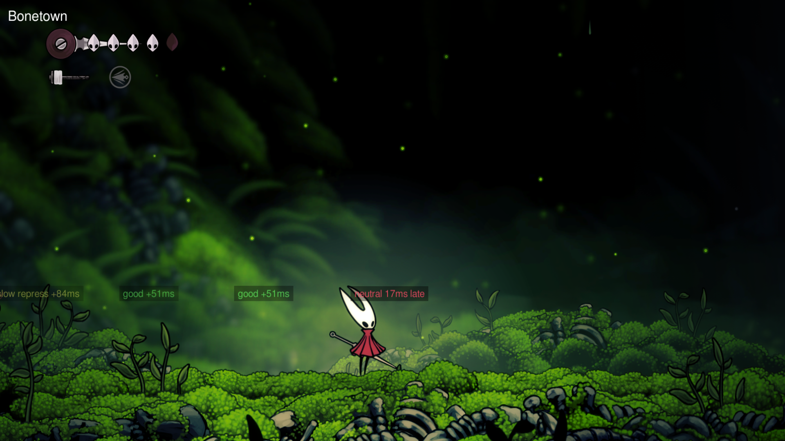

# SpeedrunGym

Contains utilities for speedrun practice. Feature ideas welcome.

Can be configured using BepInEx configuration, e.g. at runtime using [ConfigurationManager](https://thunderstore.io/c/hollow-knight-silksong/p/jakobhellermann/BepInExConfigurationManager/).

## RNG Normalization

### Craw pogo

Normalize how early the first craw dives.

- `Early` - dive as soon as possible
- `Late1` - dive after one more flap cycle
- `Late2` - dive after two more flap cycles

## Pogo Endlag Detection

When enabled, will display why a pogo endlag cancel failed, or how close it was to being optimal.

Possible popup messages:

- `good +Xms` - success, started moving X ms after the neutral landing.
- `slow repress +Xms` - same, but slower than the configured slow threshold.
- `dir repress Xms early` - failed, you pressed a direction X ms too early.
- `neutral Xms late` - you went neutral X ms too late.
- `no neutral` - you never went neutral.
